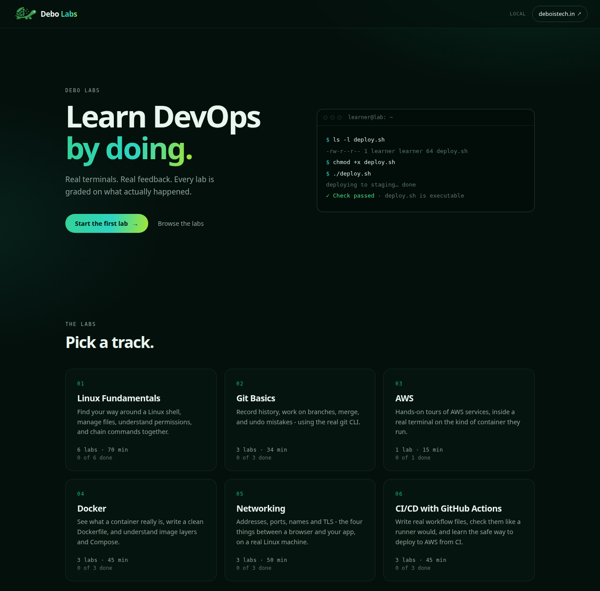

<div align="center">

# Debo Labs

**Learn DevOps by doing: a real terminal, real files, tasks graded on what actually happened.**

<!-- badges:start -->
[](https://github.com/debois-tech/debo-Labs/actions/workflows/ci.yml)
[](https://github.com/debois-tech/debo-Labs/releases)
[](LICENSE)
[](#whats-online)
[](#how-it-works)
[](#run-it-locally)
[](https://github.com/debois-tech/debo-Labs/stargazers)
<!-- badges:end -->

<!-- pitch:start -->
**19 labs · 105 graded tasks · every task proven solvable by a script.**
<!-- pitch:end -->

</div>

Not a simulator, not a quiz: each task runs a check script against the real state of a real Linux sandbox. Run it on your own
machine (**Windows, macOS or Linux**, one command, no account) or use the hosted version, which runs on [AWS Elastic Beanstalk](https://docs.aws.amazon.com/elasticbeanstalk/latest/dg/Welcome.html). Labs are plain YAML and shell scripts,
so anyone can contribute one.

## Start here

| I want to... | Open |
|---|---|
| Get comfortable in a Linux terminal | [Linux Fundamentals](labs/linux-fundamentals) |
| Automate with Bash | [Shell scripting basics](labs/linux-fundamentals/shell-scripting-basics) |
| Learn Git properly | [Git basics](labs/git-basics) |
| Understand containers and write a good Dockerfile | [Docker](labs/docker) |
| Debug "it can't connect" problems | [Networking](labs/networking) |
| Build a CI/CD pipeline | [CI/CD with GitHub Actions](labs/github-actions) |
| See what AWS Elastic Beanstalk Cluster Mode really is | [Cluster Mode lab](labs/aws/elastic-beanstalk-cluster-mode) |

## What's online

<!-- routes:start -->
| Track | Labs | Time | What you do |
|---|---|---|---|
| **Linux Fundamentals** | 6 | 70 min | Find your way around a Linux shell, manage files, understand permissions, and chain commands together. |
| **Git Basics** | 3 | 34 min | Record history, work on branches, merge, and undo mistakes - using the real git CLI. |
| **AWS** | 1 | 15 min | Hands-on tours of AWS services, inside a real terminal on the kind of container they run. |
| **Docker** | 3 | 45 min | See what a container really is, write a clean Dockerfile, and understand image layers and Compose. |
| **Networking** | 3 | 50 min | Addresses, ports, names and TLS - the four things between a browser and your app, on a real Linux machine. |
| **CI/CD with GitHub Actions** | 3 | 45 min | Write real workflow files, check them like a runner would, and learn the safe way to deploy to AWS from CI. |
<!-- routes:end -->

## Run it locally

**You need one thing: [Docker](https://www.docker.com/products/docker-desktop/)** (Docker Desktop on Windows and macOS, Docker Engine on Linux). No Node, no accounts. It is the same image the hosted version runs on Elastic Beanstalk, so what you run is what we host.

```bash
git clone https://github.com/debois-tech/debo-Labs
cd debo-Labs
./start_local_labs.sh
```

The first run builds the image (a few minutes); after that it starts in seconds. Your browser opens at **http://localhost:8080**. Press `Ctrl+C` to stop; everything you did in a lab is thrown away with its sandbox.

| Your machine | How to run it |
|---|---|
| **macOS** | Install and open Docker Desktop, then run the commands above in Terminal. |
| **Linux** | Install Docker Engine with the compose plugin (your user must be able to run `docker`), then run the commands above. |
| **Windows** | Install Docker Desktop (WSL2 backend, the default) and [Git for Windows](https://git-scm.com/download/win). Open **Git Bash** and run the commands above. Using WSL instead? Run them inside your WSL distro with Docker Desktop's WSL integration on. |

Options:

```bash
LABS_PORT=9090 ./start_local_labs.sh     # port 8080 is busy
NO_BROWSER=1 ./start_local_labs.sh       # don't open the browser
./start_local_labs.sh stop               # stop and clean up from another terminal
```

Prefer plain Compose? `docker compose up --build` does the same thing.

**Troubleshooting**
- *"Docker is installed but not running"*: open Docker Desktop and wait for it to say it is running, then run the script again.
- *`bad interpreter` or `\r` errors on Windows*: Git converted line endings. The repo's `.gitattributes` prevents this on a fresh clone; if you cloned before that, run `git rm --cached -r . && git reset --hard`.
- *Permission denied on Linux*: add yourself to the docker group (`sudo usermod -aG docker $USER`, then log out and in), or run `chmod +x start_local_labs.sh`.
- *Port in use*: pick another with `LABS_PORT`.

## What you get

The home page lists every track with its labs and your progress; each track page walks through its labs in order.

<p align="center"></p>

## How it works

```
 browser ── lesson pane + xterm.js terminal
    │  HTTP + WebSocket
 container ── node server ──▶ a real bash (node-pty) per session, as its own unprivileged user
                  └─ "Check" runs the step's checks/<id>.sh against that sandbox
                     (files? git state? your shell's cwd? a running process?)   exit 0 = pass
```

- **Track → Lab → Steps.** A step is a *lesson* (read) or a *task* (do something, press Check).
- **One engine, two profiles.** `LAB_PROFILE=local` (compose) is loopback-only with relaxed limits and works fully offline.
  The default `hosted` profile adds per-IP seat limits, tight timeouts and a same-origin guard for the public deployment (`deploy/`).
- **Safety.** Each session is a separate unprivileged user with a private home; the container drops all capabilities it doesn't need,
  has CPU/memory/PID limits and a read-only root; requests must come from the page itself (a website you visit can't drive your shell);
  the answers (`solutions/`) are unreadable from inside a lab.
- **Invite codes.** On the hosted deployment every lab needs an invite code (the pages stay public); the local app never asks.
  See `deploy/README.md`.
- **Progress** (which labs you finished) lives in your browser's localStorage. No accounts.

## Contributing and security

Contributions are welcome, labs most of all: start with [CONTRIBUTING.md](CONTRIBUTING.md). To report a vulnerability, follow
[SECURITY.md](SECURITY.md) (please don't open a public issue). The hosted version asks for an invite code; the local app never does.

**Community labs:** *Linux in Action* by [@Heyyprakhar1](https://github.com/Heyyprakhar1). Want yours here? Pick a topic that is missing from [the tracks](labs) and follow [CONTRIBUTING.md](CONTRIBUTING.md).

## Add your own lab

No JavaScript needed — see [CONTRIBUTING.md](CONTRIBUTING.md) and [docs/authoring.md](docs/authoring.md).

```bash
node scripts/new-lab.js linux-fundamentals my-lab "My lab title"        # scaffold (needs Node on the host)
# edit labs/linux-fundamentals/my-lab/{lab.yaml,checks,solutions}; refresh the browser to try it
docker compose run --rm labs node scripts/validate-labs.js --strict     # proves every task is solvable
```

## Repo map

| Path | What |
|---|---|
| `labs/` | All lab content (`<track>/<lab>/{lab.yaml,setup.sh,checks/,solutions/}`), `track.yaml` per track, `lib.sh` (check helpers) |
| `src/` | The server: sessions, sandbox, loader, profiles, header/pages |
| `public/` | Browser code and the stylesheets |
| `start_local_labs.sh` | One-command local start for macOS, Linux and Windows (Git Bash / WSL) |
| `scripts/` | `validate-labs.js` (the contribution gate), `new-lab.js`, `check-hygiene.js` |
| `test/` | Unit and integration tests (the integration tests spawn real shells; they need Linux, i.e. the image) |
| `deploy/` | Hosted deployment on AWS Elastic Beanstalk Cluster Mode: Terraform, deploy scripts, smoke test |
| `docs/` | Authoring guide, Elastic Beanstalk research notes |

## Tests

```bash
npm ci && npm run test:unit          # fast, anywhere
docker compose run --rm -v "$PWD/test:/app/test:ro" labs sh -c 'node --test --test-force-exit test/unit/*.test.js test/integration/*.test.js'
```

## License

Code, labs and docs are released under the [MIT License](LICENSE). The Debo Labs name and logo (`public/logo/`) are not covered by it:
please don't use them to suggest your fork is the official one. The lab answers in `labs/**/solutions/` are public on purpose;
the hosted image keeps them out of the learner's shell, and the local app is for learning, not exams.
